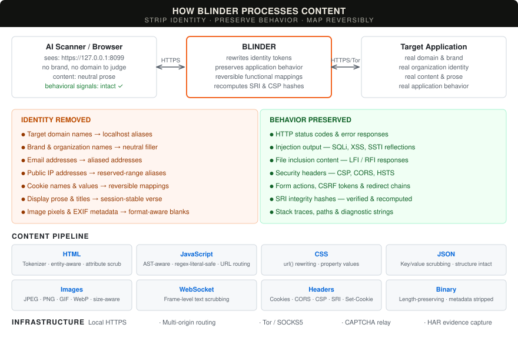

<p align="center">
  
</p>

<p align="center">
  <strong>A local reverse proxy for content-blind security scanning.</strong><br>
  Go · Local HTTPS · HTTP &amp; WebSocket · Tor / SOCKS5
</p>

<p align="center">
  <a href="#the-problem">The problem</a> &nbsp; / &nbsp;
  <a href="#how-blinder-works">How it works</a> &nbsp; / &nbsp;
  <a href="#quick-start">Quick start</a> &nbsp; / &nbsp;
  <a href="#certificates">Certificates</a> &nbsp; / &nbsp;
  <a href="#tor">Tor</a> &nbsp; / &nbsp;
  <a href="#captcha">CAPTCHA</a> &nbsp; / &nbsp;
  <a href="#evidence">Evidence</a> &nbsp; / &nbsp;
  <a href="#development">Development</a>
</p>

---

## The problem

Security testing is a behavioral discipline. A SQL injection is a SQL injection regardless of whose database it reaches. A broken access control is broken whether the application belongs to a startup or a household name. A file inclusion reads from the server no matter what logo sits in the header.

AI-assisted security tools don't work that way. They see the target -- its domain, its brand, its organization -- and they form opinions. They soften findings for well-known services. They refuse to generate proof-of-concept payloads based on *who* the target is. They decline to test paths they associate with a particular vendor. The AI is making decisions that belong to the operator, and it's making them based on context rather than behavior.

This is the wrong axis. Good application security focuses on what the application *does*: how it handles input, what controls it enforces, what it reflects back, how it fails. Identity should be irrelevant to that analysis. But today, every AI-assisted tool has the target's full identity wired into every decision it makes -- what to test, how hard to push, whether to report.

There should be a cleaner way to approach this. Blinder is a starting point: a practical tool, but also a position that testing should be separated from context. The operator authorizes the scope. The tool evaluates behavior. Those are different responsibilities and they shouldn't collapse into one.

### Behavior is sometimes content

Stripping identity doesn't mean stripping content. That's where most naive approaches break. Many vulnerability classes are observable *only* as changes in response content:

| Vulnerability | What changes in the response |
| :--- | :--- |
| **SQL injection** | Database errors, table structures, query results in the body |
| **Local/remote file inclusion** | File contents -- config files, source code, `/etc/passwd` |
| **Cross-site scripting** | Reflected attacker input rendered back into the page |
| **Server-side template injection** | Evaluated expressions returned as computed results |
| **Information disclosure** | Stack traces, internal paths, version strings in error pages |
| **Broken access control** | Data the session shouldn't be authorized to reach |

If a proxy stripped this content, it would hide the evidence of the very vulnerabilities the tester is looking for. The requirement is surgical: remove *identity* while preserving *behavioral signals*. A page that belongs to no one but behaves exactly as the original does -- including when it behaves badly.

## How Blinder works

Blinder is a local HTTPS reverse proxy that sits between the AI scanner (or browser) and the target. It rewrites identity -- domains, brands, organization names, emails, IP addresses -- while preserving the application's functional behavior: its errors, its reflections, its security controls, its status codes, its content structure.

To the downstream AI, the target is an anonymous locally hosted application at `https://127.0.0.1:8099`. No brand to recognize. No domain to form an opinion about. The AI tests what the application *does*, not who it *is*.

This is content-blind scanning: the operator controls who the target is; the AI focuses on what it does.

Replacement content is part of correctness: neutral filler for display, reversible values for application data, and preserved diagnostics and control behavior. Generated removal notices don't belong in pages.

<p align="center">
  
</p>

## What it does

| | |
| :--- | :--- |
| **Content scrubbing** | Identity tokens, domain references and cookie values rewritten across HTTP bodies, headers and WebSocket text. HTML tokenizer handles entity-encoded and attribute-embedded identities. Technical content -- vulnerabilities, error messages, injection reflections, security headers -- passes through unchanged. |
| **Resource integrity** | Original SRI verified per reference and recomputed for rewritten resources, with corresponding CSP hashes translated. Versioned references bind the served bytes; external resource integrity is preserved. |
| **Response cache** | Separate upstream/downstream cache validators. 304 revalidation merges security-policy headers. Vary-aware eviction. |
| **Session handling** | Reversible cookie names with per-value scrubbing. Multi-origin routing via `--extra-origin` with deterministic alias hostnames, Host-header routing and CORS origin translation. |
| **CAPTCHA relay** | Operator-facing challenge queue and separate provider origins. Tor-routed resources keep provider cookies, CSP and CORS separate from the target and operator. |
| **Private routing** | Upstream HTTP and WebSocket through Tor SOCKS5 with remote hostname resolution. Tor failures are hard errors, never silent fallbacks. |
| **Local HTTPS** | Local CA with 90-day lifetime and automatic renewal; session leaf certificates are signed on the fly. Trust the CA once -- adding origins or changing aliases never requires re-trusting. Ephemeral mode available. |
| **Evidence** | Pre-scrub HAR with journal-based persistence, request manifest with per-request scrub/leak counts, domain mappings and scrub report. [Paired response comparisons](docs/response-deltas.md) check byte-size fidelity and whether content/status changes survive masking. Signal-preservation checks record verified behavior and remaining defects. |

See [supported behavior and delivery gates](docs/capabilities.md) for implementation status and known limitations.

## Quick start

Build with **Go 1.26+**. The binary has no external runtime dependency.

```sh
git clone https://github.com/Splinters-io/blinder.git
cd blinder
make build
./blinder --preflight
```

Follow the OS-specific certificate advice, then start a session:

```sh
capture_dir=$(mktemp -d)
./blinder --target https://your-authorized-target.example \
  --identity YourOrganisation \
  --har "$capture_dir/session.har" \
  --output "$capture_dir/output"
```

Point your browser or scanner at **`https://127.0.0.1:8099`**. Add multiple identity tokens with repeated `--identity` flags. Stop with **Ctrl-C** to save the session evidence.

### Config file

Use `--config` (`-c`) to load defaults from a YAML file. CLI flags override the file.

```yaml
# blinder.yaml
listen: "127.0.0.1:9443"
target: "https://example.com"
alias: "target-001.local"
identity:
  - "ExampleCorp"
  - "example.com"
output: "/tmp/blinder-output"
captcha_config: "captcha.yaml"
no_verify_tls: true
tor:
  enabled: false
  addr: "127.0.0.1:9050"
har:
  path: "/tmp/session.har"
  max_body: 10485760
```

```sh
./blinder -c blinder.yaml
# override the listen port from the file:
./blinder -c blinder.yaml --listen 127.0.0.1:7777
```

## Certificates

Blinder generates a local CA (Certificate Authority) on first run and uses it to sign session-specific leaf certificates. Trust the CA once; all current and future endpoints -- including extra origins added later -- are automatically trusted without re-running setup.

| Platform | Setup |
| :--- | :--- |
| **macOS** | Run the printed `--trust-cert` command, review the CA fingerprint and approve user Keychain trust. One-time setup. |
| **Ubuntu / Linux** | Use the printed `curl --cacert` command or install the CA certificate in your browser/scanner's trust store. |

Use `--cert-dir DIR` for a chosen CA store. The CA persists for 90 days with automatic renewal; `--ephemeral-cert` generates a temporary self-signed leaf with no CA. Preflight exit **2** means platform trust needs setup; a client using its own CA file can still connect successfully.

Adding extra origins, changing the alias or reconfiguring CAPTCHA providers generates a new leaf certificate signed by the same CA -- no re-trusting required. Preflight reports trust for the listen host, primary alias, configured extra-origin aliases and, when CAPTCHA is configured, the operator and a concrete challenge hostname. With `--tor`, preflight also includes the configured provider aliases.

The CA store also holds a private `version-signing.key` for resource-reference ownership, independent of certificate renewal. Keep it across restarts so expired references remain recognisable. `--ephemeral-cert` keeps TLS temporary; resource-reference ownership still persists in the default store.

[Certificate setup, OS guidance and renewal](docs/testing.md#local-certificate-trust)

## Tor

Start your Tor service and wait for bootstrap, then select its SOCKS endpoint:

```sh
./blinder --target http://your-service.onion \
  --tor --tor-addr 127.0.0.1:9050 \
  --identity YourOrganisation
```

Clearnet targets can use the same route. Target TLS verification stays enabled. Tor failures return an error without falling back to a direct target connection.

[Tor setup and live acceptance checklist](docs/testing.md#live-tor-uat)

## CAPTCHA

When the target returns a CAPTCHA challenge, Blinder queues it for the operator. Configure providers via `--captcha-config`:

```yaml
version: 1
captcha:
  providers:
    - hcaptcha
```

Open the browser login URL printed at startup: `https://blinder-operator.localhost:<port>/__blinder/captcha/login?token=…`. This separate, local-only origin holds the operator session. Raw challenge content runs at its own `<challenge-id>.blinder-challenge.localhost` origin through an expiring view capability; the operator cookie stays on the operator origin. Bearer authentication remains available for API clients. Certificate planning includes the challenge wildcard; verify the selected browser's trust for the operator, challenge and provider hostnames. See the [operator and certificate guide](docs/testing.md#local-certificate-trust).

With `--tor`, each configured `route-with-target` provider origin gets its own `https://captcha-<hash>.localhost:<port>` address and uses the target's SOCKS transport. Static HTML references, base URLs and refresh navigation use these routes. A bounded helper also routes dynamic fetch, XHR and URL setters in provider documents without CSP; it leaves provider script bytes and integrity metadata unchanged. Documents with enforcing or report-only policies receive no helper. Provider errors and actual CORS decisions remain visible, and cookies stay under browser control. The old `/__blinder/captcha/res` endpoint returns 404 on target and operator origins.

Built-in profiles cover hCaptcha, reCAPTCHA and Turnstile. Custom providers use explicit `resource_origins`, optional `resource_url_regex`, `opaque_fields` and `submissions`; every relayed request is checked against that scope. Direct mode leaves provider references intact, and `tor_policy: direct` remains an explicit Tor exception.

Chrome completed the synthetic operator flow: all 13 provider requests used the relay, and the original POST resumed with its exact solution token, session and refreshed CSRF. A separate cross-site Lax-cookie case preserved the direct provider's HTTP 400 denial. This is bounded local acceptance: CSP-restricted challenges, other dynamic loading APIs, actual alias trust, real-provider human completion and live Tor/onion acceptance remain open. The [repeatable browser checks](docs/testing.md#captcha-browser-acceptance) record those gates separately.

### Local testing

hcaptcha and reCAPTCHA reject `localhost` and `127.0.0.1` as hostnames. To test locally with those providers, add a hosts entry and use that hostname as the `--target`:

```
# /etc/hosts
127.0.0.1 uat.blinder.test
```

```
blinder --target http://uat.blinder.test:9999 ...
```

Turnstile test keys work on localhost without a hosts entry.

| Provider | Test sitekey | Test secret |
| :--- | :--- | :--- |
| hcaptcha | `10000000-ffff-ffff-ffff-000000000001` | `0x0000000000000000000000000000000000000000` |
| Turnstile | `1x00000000000000000000AA` | `1x0000000000000000000000000000000AA` |

hcaptcha test keys always pass without a visual challenge. Turnstile test key `1x...AA` always passes; `3x00000000000000000000FF` forces an interactive challenge.

## Evidence

Keep original captures on the operator's side; they contain real target data.

> **Security note:** HAR files contain the complete pre-scrub HTTP exchange, including `Authorization`, `Cookie` and `Set-Cookie` headers. They are written with owner-only permissions (0600), but anyone with access to the file has every credential that transited the proxy during that session. Treat HAR files as secrets: do not commit them to version control, share them without redaction, or store them on shared filesystems.

| Output | Contents |
| :--- | :--- |
| `--har FILE` | Original HTTP requests and responses before scrubbing. Journal-based persistence with periodic flushes. |
| `blinder-manifest.json` | HTTP outcomes, per-request identity/domain replacement counts and leak counts. |
| `blinder-dealias.json` | Alias-to-original domain mapping. |
| `blinder-scrub-report.json` | Recorded identity/domain matches and aggregate counts. |

JSON reports are saved under `--output DIR` with owner-only file permissions. `--har-max-body` bounds each captured request/response body, with truncation recorded in the HAR. Shutdown attempts both HAR and report output even if one fails.

[Capture behavior and artifact format](docs/capabilities.md#evidence)

## Development

```sh
make test              # 768 package tests with race detection
make lint              # Go vet
make test-functional   # 35 functional scenarios: CLI, TLS, sessions,
                       # evidence, WebSocket, SOCKS5 and CAPTCHA
```

All tests pass with `-race`. Browser-level acceptance tests are opt-in via `BLINDER_REVIEW_BROWSER=1`.

[Testing and UAT guide](docs/testing.md) · [Delivery gates](docs/capabilities.md#remaining-delivery-gates) · [Technical specification](SPEC.md)

---

<p align="center">
  <br>
  <sub>LESS IDENTITY. MORE SIGNAL.</sub><br>
  <sub><a href="docs/brand.md">Project artwork</a></sub>
</p>
